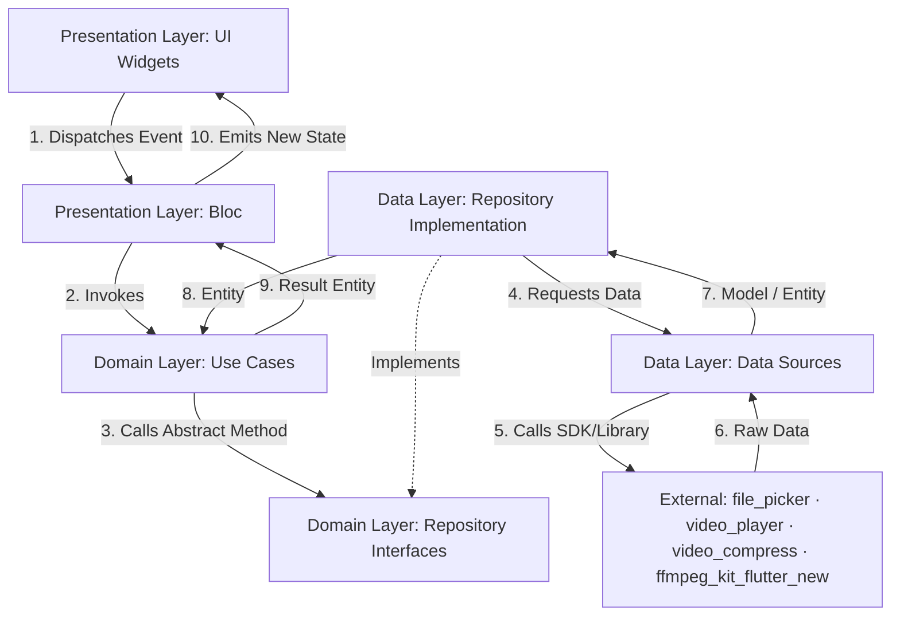

# Project Architecture

Robot Video Compressor follows the **Clean Architecture** paradigm combined with a **Feature-First** structure. This enforces a separation of concerns, makes testing straightforward, and guarantees codebase scalability.

---

## 📐 Directory & Layer Architecture

The codebase is organized into features under the [lib/features/](file:///c:/projects/robot_compresor_video/lib/features/) folder. The shared configurations, common errors, themes, and services are located under [lib/core/](file:///c:/projects/robot_compresor_video/lib/core/).

```
lib/
├── main.dart
├── core/
│   ├── constants/
│   ├── errors/
│   ├── routes/
│   ├── services/
│   └── theme/
│
├── features/
│   ├── home/
│   │   └── presentation/
│   │       ├── bloc/                  # HomeSectionBloc
│   │       ├── widgets/
│   │       ├── home_screen.dart        # Pantalla Home (selector de modos)
│   │       ├── compressor_screen.dart  # Pantalla de compresión básica
│   │       └── loading_screen.dart
│   │
│   └── compress_video/
│       ├── data/
│       │   ├── datasources/
│       │   │   ├── video_picker_datasource.dart
│       │   │   ├── video_metadata_datasource.dart    # Metadata básica (video_player)
│       │   │   ├── video_compressor_datasource.dart  # Motor básico (video_compress)
│       │   │   ├── video_storage_datasource.dart
│       │   │   ├── ffmpeg_datasource.dart            # Motor avanzado (FFmpeg)
│       │   │   └── ffmpeg_command_builder.dart       # Constructor de comandos FFmpeg
│       │   └── repositories/
│       │       ├── video_repository_impl.dart        # Implementa VideoRepository
│       │       └── advanced_video_repository_impl.dart # Implementa AdvancedVideoRepository
│       ├── domain/
│       │   ├── entities/
│       │   │   ├── video_file.dart
│       │   │   ├── compression_config.dart           # Config motor básico
│       │   │   ├── compression_result.dart
│       │   │   ├── advanced_compression_config.dart  # Config motor avanzado (FFmpeg)
│       │   │   └── advanced_compression_result.dart
│       │   ├── repositories/
│       │   │   ├── video_repository.dart             # Contrato motor básico
│       │   │   └── advanced_video_repository.dart    # Contrato motor avanzado
│       │   └── use_cases/
│       │       ├── pick_video_use_case.dart
│       │       ├── compress_video_use_case.dart      # Usa video_compress
│       │       ├── compress_video_advanced_use_case.dart # Usa FFmpeg
│       │       ├── get_extended_metadata_use_case.dart   # Metadata via FFprobe
│       │       └── save_video_use_case.dart
│       └── presentation/
│           └── bloc/
│               ├── video_bloc.dart
│               ├── video_event.dart
│               └── video_state.dart
│
└── shared/
    ├── extensions/
    └── widgets/
```

---

## 🎬 Dual Compression Engine

The application has two independent compression engines that coexist without interfering with each other.

### Engine 1 — Basic (video_compress)

| Aspect | Detail |
|---|---|
| Library | `video_compress: 3.1.4` |
| Entry point | `VideoCompressorDatasource` |
| Repository | `VideoRepository` / `VideoRepositoryImpl` |
| Use case | `CompressVideoUseCase` |
| Config entity | `CompressionConfig` (quality: low/medium/high) |
| Result entity | `CompressionResult` |
| BLoC event | `CompressVideoRequested` |
| BLoC status | `VideoStatus.compressing` |
| When to use | Quick compression with preset quality levels, no fine-grained control needed |

### Engine 2 — Advanced (FFmpeg)

| Aspect | Detail |
|---|---|
| Library | `ffmpeg_kit_flutter_new: ^4.6.0` |
| Entry point | `FfmpegDatasource` |
| Command builder | `FfmpegCommandBuilder` |
| Repository | `AdvancedVideoRepository` / `AdvancedVideoRepositoryImpl` |
| Use case | `CompressVideoAdvancedUseCase` |
| Config entity | `AdvancedCompressionConfig` (bitrate, fps, extensible) |
| Result entity | `AdvancedCompressionResult` (includes `ffmpegCommand` for debugging) |
| BLoC event | `CompressVideoAdvancedRequested` |
| BLoC status | `VideoStatus.compressingAdvanced` |
| When to use | Advanced section: user controls specific output parameters (bitrate, fps, etc.) |

Both engines always operate on the **original video** (`state.video`), never on a previously compressed result.

---

## 🔧 Why ffmpeg_kit_flutter_new

`ffmpeg_kit_flutter_new` is the most actively maintained fork of the original `ffmpeg_kit_flutter` package (archived in 2024). It was selected because:

- Compatible with Flutter 3.x and Dart SDK ^3.x
- Supports Android API 36 and current iOS targets
- Actively maintained with Play Store compatible builds
- Includes both `FFmpegKit` (execution) and `FFprobeKit` (metadata extraction)
- No breaking API changes from the original — migration path is straightforward

---

## 🏗️ FfmpegCommandBuilder — Extensibility Design

`FfmpegCommandBuilder` is the single point of truth for FFmpeg command construction. Its design allows adding new compression parameters without modifying any other class:

```dart
// To add CRF support in a future iteration:
// 1. Add field to AdvancedCompressionConfig:
//    final int? crf;
//
// 2. Add one block in FfmpegCommandBuilder.build():
//    if (config.crf != null) args.addAll(['-crf', config.crf.toString()]);
//
// 3. Done. No changes needed in repository, use case, or BLoC.
```

Parameters already prepared (commented in code, ready to uncomment):
- `videoCodec` — e.g. `libx264`, `libx265`
- `crf` — Constant Rate Factor (0–51)
- `preset` — e.g. `fast`, `medium`, `slow`
- `width` / `height` — output resolution (preserves aspect ratio)
- `targetAudioBitrate` — audio bitrate in bps

---

## 🔄 Data Flow



---

## 🎯 Architecture Principles Applied

### 1. Separation of Concerns
- **Domain Layer**: Pure Dart. Zero dependencies on Flutter widgets or external packages. Defines entities, repository contracts, and use cases.
- **Data Layer**: Integrates external libraries (`video_compress`, `ffmpeg_kit_flutter_new`). Implements repository contracts.
- **Presentation Layer**: BLoC + UI. Dispatches events, consumes states.

### 2. Dependency Inversion
- `CompressVideoUseCase` depends on `VideoRepository` (abstract).
- `CompressVideoAdvancedUseCase` depends on `AdvancedVideoRepository` (abstract).
- Concrete implementations are injected via `get_it` in [injection_container.dart](file:///c:/projects/robot_compresor_video/lib/core/services/injection_container.dart).

### 3. Engine Independence
- The two engines share `VideoFile` as input and produce separate result entities.
- Replacing or upgrading either engine only requires changes in its datasource and repository implementation — domain and BLoC remain untouched.

---

## 🔌 Service Locator & Dependency Injection

Managed in [injection_container.dart](file:///c:/projects/robot_compresor_video/lib/core/services/injection_container.dart):

- `registerLazySingleton` — datasources, repositories, use cases, `FfmpegCommandBuilder`
- `registerFactory` — BLoCs (fresh instance per screen)

---

*Related Documentation*:
- State management details: [BLOC_SYSTEM.md](./BLOC_SYSTEM.md)
- Complete directory listing: [PROJECT_STRUCTURE.md](./PROJECT_STRUCTURE.md)
- Feature status: [STATUS.md](./STATUS.md)
