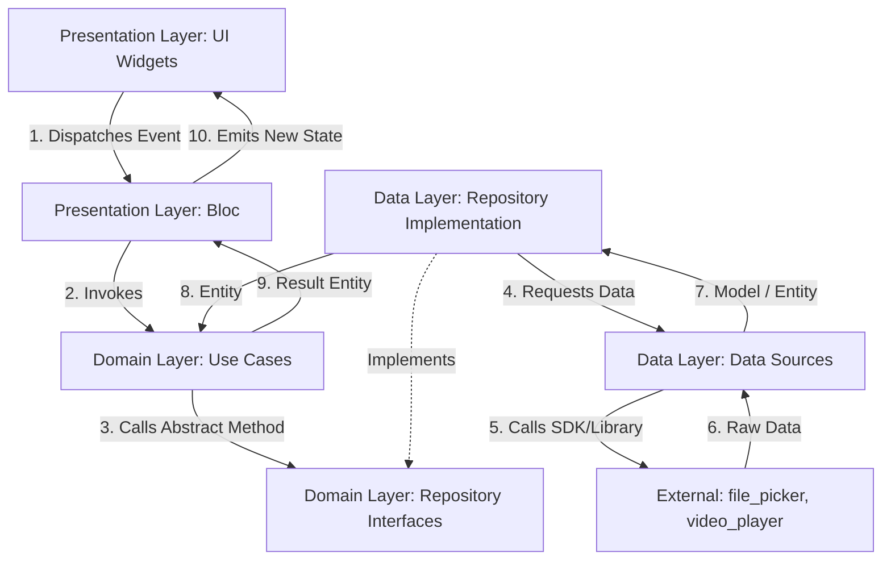

# Project Architecture

Robot Video Compressor follows the **Clean Architecture** paradigm combined with a **Feature-First** structure. This enforces a separation of concerns, makes testing straightforward, and guarantees codebase scalability.

---

## 📐 Directory & Layer Architecture

The codebase is organized into features under the [lib/features/](file:///c:/projects/play_console_2/robot_compresor_video/lib/features/) folder. The shared configurations, common errors, themes, and services are located under [lib/core/](file:///c:/projects/play_console_2/robot_compresor_video/lib/core/).

```
lib/
├── main.dart                          # Application entry point
├── core/                              # Shared cross-cutting concerns
│   ├── constants/                     # Global constants (colors, layouts)
│   ├── errors/                        # Custom exception & failure definitions
│   ├── routes/                        # Route setup and appRouter configuration
│   ├── services/                      # Services (e.g., ScreenSizeService for responsive calculation)
│   ├── theme/                         # UI Theme files (dark/light themes)
│   └── utils/                         # Global helpers and utility extension methods
│
├── features/                          # Domain-scoped app features
│   ├── home/                          # High-level container orchestration
│   │   └── presentation/              # Tab UI and PageView animations
│   │       ├── bloc/                  # HomeSectionBloc (tab state management)
│   │       ├── widgets/               # AnimatedSectionTabs, section pages wrappers
│   │       ├── home_screen.dart       # Main tab scaffold
│   │       └── loading_screen.dart    # Intro splash loader with progress meter
│   │
│   └── compress_video/                # Main feature area (Video Picking & Compressing)
│       ├── data/                      # Data layer (fetching, external APIs, plugins)
│       │   ├── datasources/           # File Pickers, Metadata extraction, compression plugin wrappers
│       │   └── repositories/          # Implementations of domain repository interfaces
│       ├── domain/                    # Pure business logic (Independent of UI or external packages)
│       │   ├── entities/              # Business data models (VideoFile, CompressionConfig, etc.)
│       │   ├── repositories/          # Abstraction contracts for data access
│       │   └── use_cases/             # Single-purpose orchestrator classes (PickVideo, CompressVideo)
│       └── presentation/              # Video presentation components
│           └── bloc/                  # VideoBloc (tracks video loading, selection state)
│
└── shared/                            # Widgets and extensions shared across multiple features
    ├── extensions/
    └── widgets/
```

---

## 🔄 Data Flow

When a user triggers an action (like selecting a file or tapping compress), data travels through the layers as follows:



---

## 🎯 Architecture Principles Applied

### 1. Separation of Concerns (Clean Architecture Layers)
- **Domain Layer**: The heart of the application. It contains pure Dart entities and use cases. It has *zero* dependencies on UI widgets, database plugins, or external packages (like `file_picker` or `video_player`). It depends solely on abstractions.
- **Data Layer**: Responsible for retrieving raw data from device services and mapping them to domain entities. It contains the concrete implementations of the repositories defined in the domain layer.
- **Presentation Layer**: Handles UI components and BLoC state managers. It listens to the streams exposed by the BLoC and displays the states accordingly.

### 2. Dependency Inversion
- Classes depend on abstract contracts rather than concrete implementations. For instance, `PickVideoUseCase` depends on `VideoRepository` (an abstract interface inside `domain/repositories/`).
- The concrete instance `VideoRepositoryImpl` is registered and injected globally using **GetIt** service locator during application startup ([injection_container.dart](file:///c:/projects/play_console_2/robot_compresor_video/lib/core/services/injection_container.dart)).

### 3. Feature-Based Organization
- Instead of grouping everything by layer type (`models/`, `views/`, `controllers/` at the root), code is grouped by feature.
- This creates clear boundaries: the `home` feature remains agnostic of how videos are read or compressed, focusing only on page transitions. The `compress_video` feature encapsulates all business logic regarding video processing.

---

## 🔌 Service Locator & Dependency Injection

Dependency injection is managed inside [injection_container.dart](file:///c:/projects/play_console_2/robot_compresor_video/lib/core/services/injection_container.dart) using the `get_it` package. 

- **Singletons (`registerLazySingleton`)** are used for data sources, repositories, and use cases to maintain a single memory space.
- **Factories (`registerFactory`)** are used for BLoCs to ensure that a fresh, disposable instance is created whenever a screen initializes.

---

## ✅ Architectural Benefits

1. **Testability**: Because the domain logic is decoupled from Flutter widgets and plugins, write unit tests for Use Cases without mock-initializing the Flutter SDK environment.
2. **Framework Independence**: If we decide to swap out `file_picker` for a different selection package, we only need to write a new implementation in the data layer datasource. The domain use cases and UI screens will require zero modifications.
3. **High Cohesion & Low Coupling**: Code changes in the Video Picker implementation will not break layout components in tab structures.

---

*Related Documentation*:
- State management details: [BLOC_SYSTEM.md](./BLOC_SYSTEM.md)
- Complete directory listing: [PROJECT_STRUCTURE.md](./PROJECT_STRUCTURE.md)
